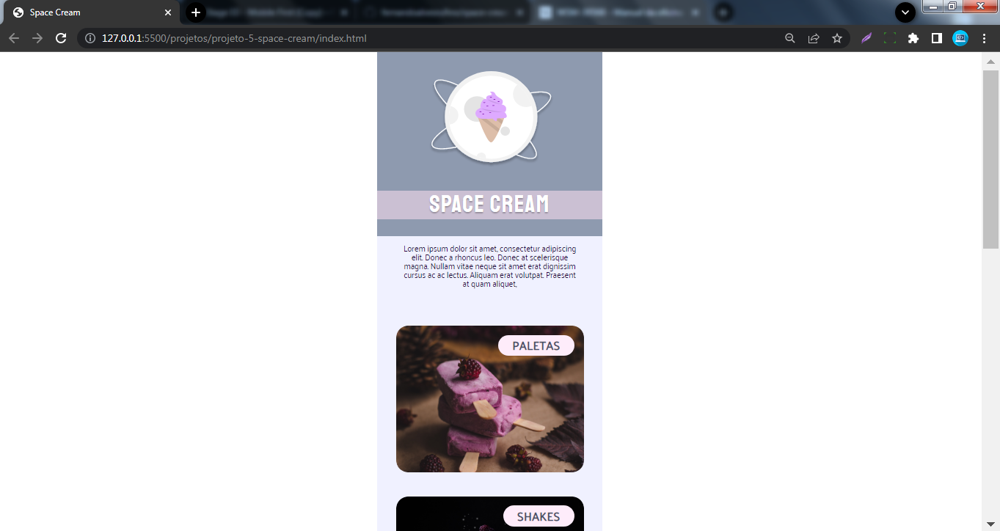
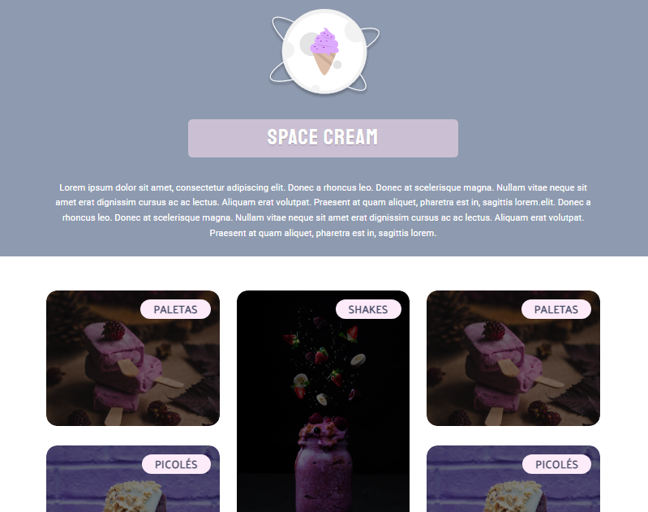
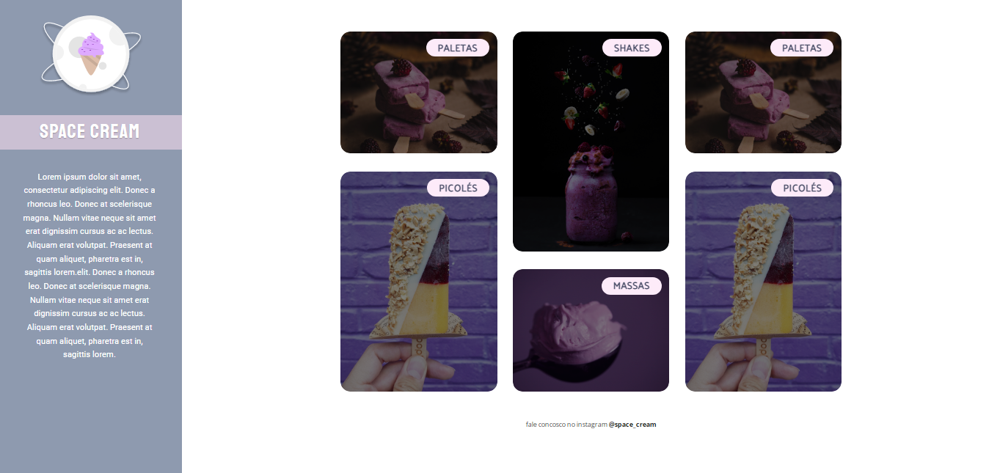

<h1 align="center"> Space Cream - Ice Cream Website </h1>

<!-- 

  <a href="#-technologies">Technologies</a>&nbsp;&nbsp;&nbsp;|&nbsp;&nbsp;&nbsp;
  <a href="#-project">Project</a>&nbsp;&nbsp;&nbsp;|&nbsp;&nbsp;&nbsp;
  <a href="#-license">License</a>&nbsp;&nbsp;&nbsp;|&nbsp;&nbsp;&nbsp;
  <a href="#readme-in-portuguese">README in Portuguese</a>

 -->

> [Technologies](#technologies)

> [Project](#project)

> [License](#license)

> [README in Portuguese](#readme-in-portuguese)

  

 

  
  Mobile version

  
  Tablet version

  
  Desktop version

## Technologies

This project was developed with the following technologies:

- HTML
- CSS
- Git and Github
- Figma

## Project

Built the Space Cream website, an ice cream page using concepts of responsive website and Grid display.

- To access the finished project, [click here](https://fernandoalvesrufino.github.io/space-cream-page/).

 
## License

This project is licensed under the MIT.

---

by Fernando Rufino

`Project created by Rocketseat`

 
 
 

# README in portuguese
 
 

<h1 align="center"> Space Cream - Site de sorvetes </h1>

  <a href="#-tecnologias">Tecnologias</a>&nbsp;&nbsp;&nbsp;|&nbsp;&nbsp;&nbsp;
  <a href="#-projeto">Projeto</a>&nbsp;&nbsp;&nbsp;|&nbsp;&nbsp;&nbsp;
  <a href="#memo-licença">Licença</a>

  

 

  
  Versão para mobile

  
  Versão para tablet

  
  Versão para desktop

## Tecnologias

Esse projeto foi desenvolvido com as seguintes tecnologias:

- HTML
- CSS
- Git e Github
- Figma

## Projeto

Construido o site Space Cream, uma página de sorvetes utilizando conceitos de responsividade e display Grid.

- Para acessar ao projeto finalizado, [clique aqui](https://fernandoalvesrufino.github.io/space-cream-page/).

 
## :memo: Licença

Esse projeto está sob a licença MIT.

---

by Fernando Rufino

> Projeto criado pela Rocketseat 